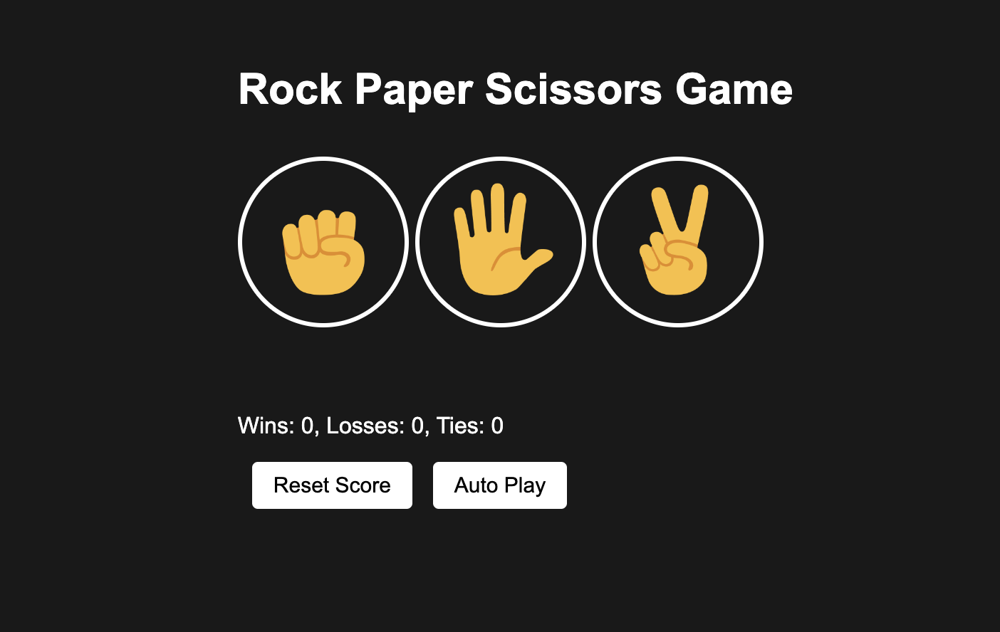

# Rock-Paper-Scissors Game
This is a webapp example of the game Rock-Paper-Scissors.This app is based on the content of the JS webapp development course from <a src="https://www.youtube.com/watch?v=SBmSRK3feww&t=99s">supersimpledev</a>.

## Run webapp locally
In order to run the webapp locally follow these steps.
1. Clone this repository to your local computer:
```git clone https://github.com/peroap/rock-paper-scissors-game.git``` (for more information on how to clone from Github click <a src="https://docs.github.com/en/repositories/creating-and-managing-repositories/cloning-a-repository">here</a>)
2. Open the html file `rock-paper-scissors.html` with <a src="https://code.visualstudio.com/">VS Code</a>. 
3. Once the file has been opened, right click on the code and click on <b>Open with Live Server</b> (in case you needguidance on how to enable <b>Live Server</b>, click <a src="https://marketplace.visualstudio.com/items?itemName=ritwickdey.LiveServer">here</a>).

By following the previous steps, you should then land in the following screen:


## Game Instructions
The game has 2 modes, '<b>human vs. computer</b>' and '<b>autoplay</b>' (computer vs. computer).

### human vs. computer:
Click on one of the icons on the screen.
The computer will randomly select a movement and the result of the round will be displayed on the screen.
The total score is also displayed.

Alternatively you can use your keyboard to choose your move:
- Press the 'r'-key to select 'rock'.
- Press the 'p'-key to select 'paper'.
- Press the 's'-key to select 'scissors'.  

### autoplay (computer vs. computer):
Click on the Autoplay-button.
The computer will start to play agains itself and update the total score.
The computer completes a new game every 2 seconds.

Alternatively, you can press the 'a'-key on your keyboard to start the autoplay mode.
You can stop the autoplay mode by clicking 'a' again.

### Resetting the score
Click on the 'Reset Score'-button.
The program will then prompt a message asking you if you are sure you want to reset the score.
Confirm by clicking on the 'Yes'-button to reset the score.

Alternatively you can press the 'backspace'-key to reset the score.